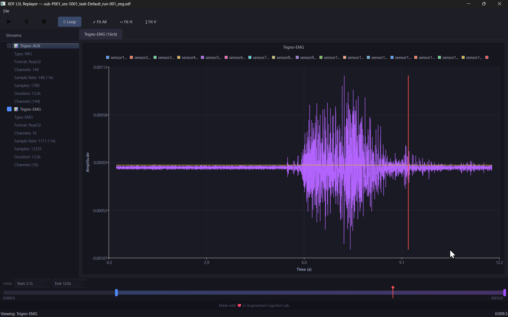

# XDF LSL Replayer


A cross-platform desktop application (Windows 11, macOS) that loads XDF files and replays LSL recordings — both visually and by pushing data back onto the LSL network.

## Features

- **Open XDF files** via drag-and-drop or File → Open
- **Time-series visualization** — line charts per stream/channel with zoom, pan, and fit-axes
- **LSL network replay** — pushes recorded streams as live LSL outlets
- **Playback controls** — Play, Pause, Stop
- **Loop with custom region** — draggable loop start/end markers on the timeline
- **Min-max downsampling** for large recordings (>10k samples per channel)

## Dependencies

- [Qt 6](https://www.qt.io/) (Widgets, Charts)
- [liblsl](https://github.com/sccn/liblsl) (fetched automatically via CMake)
- [libxdf](https://github.com/xdf-modules/libxdf) (fetched automatically via CMake)
- CMake ≥ 3.20
- C++17 compiler (MSVC on Windows, Clang on macOS)

## Building

### Windows (MSVC)

```bash
# Ensure Qt6 is installed and CMAKE_PREFIX_PATH points to it
cmake -B build -DCMAKE_PREFIX_PATH="C:/Qt/6.x.x/msvc2022_64"
cmake --build build --config Release
```

### macOS (Clang)

```bash
cmake -B build -DCMAKE_PREFIX_PATH="~/Qt/6.x.x/macos"
cmake --build build --config Release
```

## Usage

1. Launch the application
2. Open an XDF file (drag-and-drop onto the window, or File → Open)
3. Browse streams via tabs; each tab shows a time-series chart
4. Use toolbar buttons to Play / Pause / Stop replay
5. Toggle **Loop** and drag the blue handles on the timeline to set a custom loop region
6. Zoom: scroll wheel or rubber-band select. Pan: middle-mouse drag. Fit: click "Fit" button.

During playback, recorded streams are pushed onto the LSL network with the suffix `_replay` appended to each stream name.

## Project Structure

```
src/
├── main.cpp              # Entry point
├── MainWindow.h/.cpp     # Main window, menus, toolbar, file handling
├── XdfLoader.h/.cpp      # XDF file parsing via libxdf
├── LslReplayEngine.h/.cpp# LSL replay in background thread
├── StreamChartView.h/.cpp# Per-stream chart widget (QtCharts)
└── TimelineWidget.h/.cpp # Timeline bar with loop region markers
```

## License

MIT
